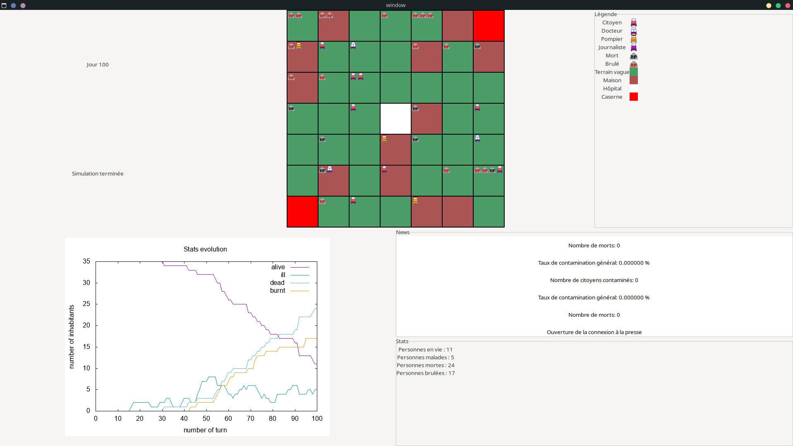
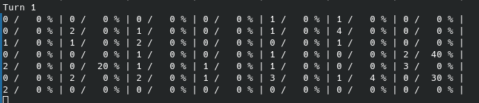
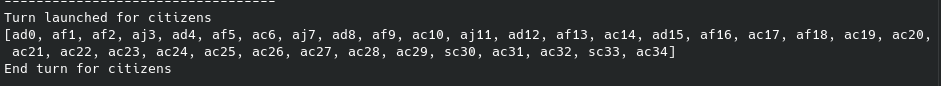

[](https://www.ensicaen.fr)
# Projet Epidemie
## CHAID-AKACEM Jasmine, BUIL Bastien, HAMMAMI Sonia et BUFFLER Hugo



### Description

Le but de ce projet est de créer un simulateur d'épidémie en C avec une interface graphique. Ce dernier est composé de quatre programmes que sont :
- epidemicSim, programme responsable du lancement de la simulation et de l'initialisation de cette dernière
- citizenManager, programme responsable de la gestion des citoyens
- pressAgency, programme responsable des dépêches envoyées par les journalistes. 
- timer, programme responsable de la gestion du temps au sein de la simulation. Lorsque l'interface graphique est fenêtrée, le timer est remplacé par la fenêtre elle même.

En ce qui concerne la simulation en elle-même, cette dernière est composée d'une ville de 49 cases dans laquelle des personnes se déplacent librement de façon aléatoire.
Chaque case peut être soit une maison, un hôpital, une caserne ou un terrain vague, chacune d'entre elles ayant des caractéristiques spécifiques.
Par exemple, personne ne peut entrer dans une caserne, si un pompier n'y ait pas déjà présent.

Enfin, chaque personne peut avoir un état parmi les quatre suivants que sont :
- alive
- sick
- dead
- burned

Les malades et les morts ont la particularité de pouvoir infecter les autres citoyens que cela soit sur leur propre case
que sur les cases voisines.

À la fin du programme, gnuplot génère une image au format png nommée `evolution_stats.png` retraçant l'évolution de la simulation.

### Structure du projet
```
.
├── src
│   ├── windowConnector.c
│   ├── utils.c
│   ├── timer.c
│   ├── printInformations.c
│   ├── pressAgency.c
│   ├── pcg_basic.c
│   ├── mainWindow.c
│   ├── epidemicSim.c
│   ├── doctorUtils.c
│   └── citizenManager.c
├── sprites
│   ├── journalist.png
│   ├── firefighter.png
│   ├── doctor.png
│   ├── dead.png
│   ├── citizen.png
│   └── burned.png
├── scripts
│   ├── run.sh
│   ├── runConsoleApp.sh
│   ├── install.sh
│   ├── installConsoleAppSilenceMode.sh
│   └── installConsoleApp.sh
├── README.md
├── Makefile
├── include
│   ├── windowConnector.h
│   ├── utils.h
│   ├── timer.h
│   ├── pthread_barrier.h
│   ├── printInformations.h
│   ├── pressAgency.h
│   ├── pcg_basic.h
│   ├── mainWindow.h
│   ├── epidemicSim.h
│   ├── doctorUtils.h
│   ├── define.h
│   └── citizenManager.h
├── commandes.gp
└── build
    └── obj

```

Le dossier `src` et `include` contiennent le nécessaire pour compiler le logiciel, dans le dossier `build`. 

Le fichier `commandes.gp` est un fichier nécessaire à l'exécution du programme.

Le dossier `scripts` contient des scripts bash facilitant l'installation du logiciel sous plusieurs formes. 


### Compiler le projet

Le projet peut être compilé sous différentes formes. 

- Le logiciel classique (nommé SILENCE_MODE). Les seuls affichages dans la console seront ceux de `pressAgency` et des dépêches.
- Le logiciel avec interface en ligne de commande (nommé CONSOLE_MODE). 
- Le logiciel avec interface graphique fenêtrée (mode de compilation par défaut)

Toutes les commandes indiquées ci-après doivent être exécutées à la racine du projet. 

#### Compiler le logiciel en mode par défaut

##### Pré requis

Il faut avoir installé le nécessaire pour compiler des éléments en librairie gtk3.

Sous Debian/Ubuntu

```bash
sudo apt-get install libgtk-3-dev
```

Plus d'information sur le site de gtk3 https://www.gtk.org/docs/installations/linux [https://www.gtk.org/docs/installations/linux]


##### Installation 
Utilisez le script `run.sh` qui se chargera de la compilation et de l'exécution du programme pour vous.

```bash
./scripts/run.sh
```

Ce script appelle lui-même le script `install.sh` qui permet de compiler le projet de manière adéquate.
Si vous souhaitez exécuter vous-même le logiciel à partir de la console, exécutez ces lignes :

```bash
./build/epidemicSim &
sleep 0.5
./build/pressAgency &
sleep 0.5
./build/citizenManager &
sleep 0.5
./build/window
```

Les détails de la compilation sont disponibles dans les scripts.

#### Logiciel en SILENCE_MODE

Utilisez le script `runConsoleApp.sh` qui se chargera de la compilation et de l'exécution du programme pour vous.

```bash
./scripts/runConsoleApp.sh
```

Ce script appelle lui-même le script `installConsoleAppSilenceMode.sh` qui permet de compiler le projet de manière adéquate.
Si vous souhaitez exécuter vous-même le logiciel dans la console, exécutez ces lignes (sans oublier d'appuyer sur entrée):

```bash
./build/epidemicSim &
sleep 0.5
./build/pressAgency &
sleep 0.5
./build/citizenManager &
sleep 0.5
./build/timer
```
Les détails de compilation sont disponibles dans les scripts. 

#### Logiciel en CONSOLE_MODE

Utilisez le script `installConsoleApp.sh` pour effectuer la compilation du projet.

```bash
./scripts/installConsoleApp.sh
```

Pour lancer le logiciel, nous vous conseillons d'utiliser quatre fenêtres de terminal séparées afin que les affichages se passent bien. 

Puis respectez l'ordre d'exécution:

##### Terminal 1
```bash
./build/epidemicSim
```

##### Terminal 2
```bash
./build/pressAgency
```

##### Terminal 3
```bash
./build/citizenManager
```

##### Terminal 4
```bash
./build/timer
```

##### Légende



Chaque cellule dans l'affichage ci-dessus utilise le format suivant : \
nombre de personnes dans la cellule / contamination de la cellule en pourcentage.


Le tableau présent dans l'affichage ci-dessus présente l'état de chaque personne présente dans la ville. \
Le format est le suivant : état + travail + index ; chaque lettre correspondant à la première lettre de l'état ou du métier 
correspondant. 
Ainsi, on a,
<table>
<tr><td>état</td><td>format</td></tr>
<tr><td>En vie</td><td>a</td></tr>
<tr><td>Malade</td><td>s</td></tr>
<tr><td>Mort</td><td>d</td></tr>
<tr><td>Brulé</td><td>b</td></tr>
</table>
<table>
<tr><td>métier</td><td>format</td></tr>
<tr><td>citoyen</td><td>c</td></tr>
<tr><td>journaliste</td><td>j</td></tr>
<tr><td>docteur</td><td>d</td></tr>
<tr><td>pompier</td><td>f</td></tr>
</table>
Dès lors, d'après les tables précédentes, sj25 correspondant à un journaliste malade et d'index 25.

### Nettoyer le dossier `build`

```bash
make mrproper
```

### Bugs connus 

Actuellement nous n'avons qu'un bug connu qui concerne la version par défaut du logiciel. 

Lorsque la simulation arrive à son terme, pour une raison inconnue, le fichier `evolution.txt` n'est pas trouvé par gnuplot et le graphique ne peut être dessiné, et par conséquent ne peut être affiché dans l'interface. 
